# load_balancer
CS60002: Distributed Systems 

## Assignment 1: Implementing a Customizable Load Balancer with consistent hashing
Contributors for this project are:
- 131401 Jonathan Wamarema
- 136618 Okoth Stanley
- 135447 Trevor Kamatu
- 127476 Allan Karanja
- 134639 Jeremy Angwenyi
  
---

## Usage
### Running the load balancer

- To build the Docker containers:
  ```bash
  docker-compose build
  ```
- To start the Docker containers:
  ```bash
  docker-compose up
  ```
- Adding new servers to the container:
  ```bash
  curl -X POST -H "Content-Type: application/json" -d '{"n": 3, "hostnames": ["S1", "S2", "S3"]}' http://localhost:5000/add
  ```
- To get the status of replicas
  ```bash
  curl http://localhost:5000/rep
  ```
- To remove the servers:
  ```bash
  curl -X DELETE -H "Content-Type: application/json" -d '{"n": 2, "hostnames": ["S1", "S2"]}' http://localhost:5000/rm
  ```
- To route to a server
  ```bash
  curl http://localhost:5000/home
  ```

- Cleanup:
  ```bash
  docker ps -a | grep './server' | awk '{print $1}' | xargs docker rm --force
  docker-compose down
  ```

## Analysis
### A1. 10000 async requests on N = 3
  
  - 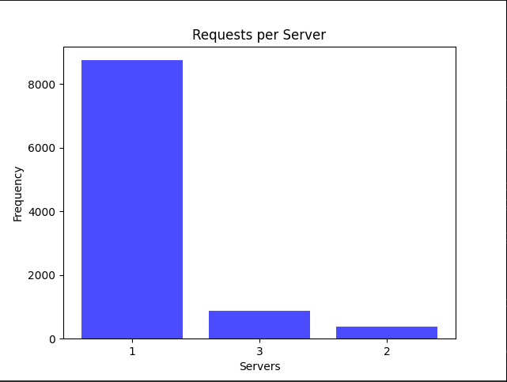

We initiated 10,000 asynchronous requests on a system configured with N = 3 server containers. The subsequent bar chart reveals an uneven distribution, with a significant number of requests being routed to a single server. This suggests that the initial hash function is suboptimal, leading to an imbalanced load distribution among the servers. Consequently, the system's current performance is subpar due to the limitations of the hash function.

Numerous hashing algorithms operate without maintaining state for routing requests, making the choice and distribution of the hash function critical to preventing oversubscription (similar to a hot partition in sharded databases). In line with [shard rebalancing](https://shopify.engineering/mysql-database-shard-balancing-terabyte-scale), adjusting the hash function may be necessary to improve the situation.
  
  ### A2. N from 2 to 6 and launch 10000 requests on each such increment
  
  - 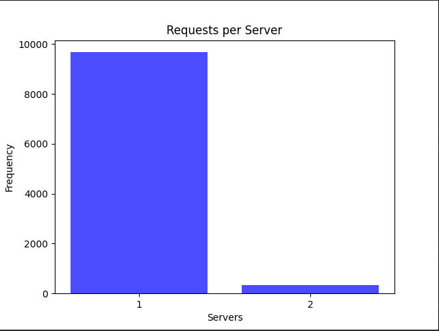
  - 
  - 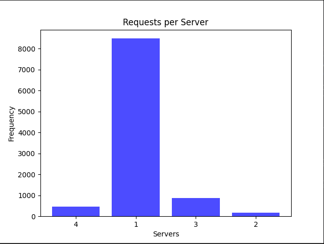
  - 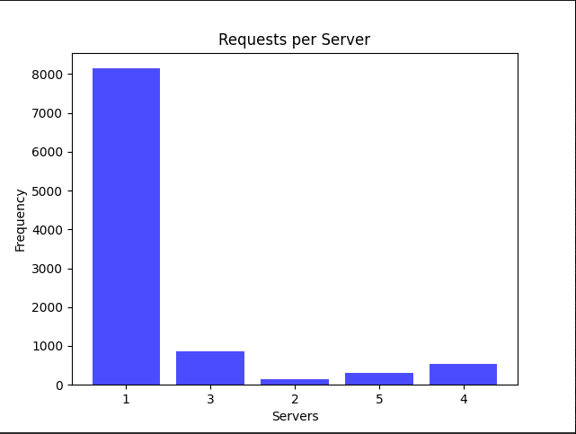
  - 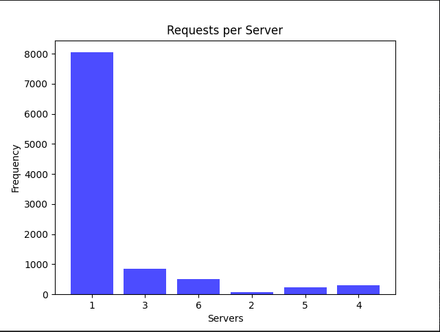
  - 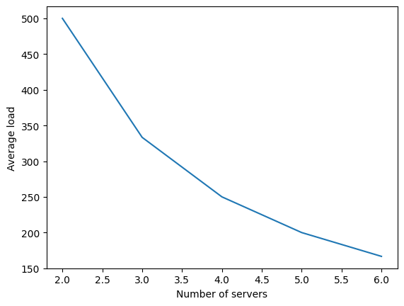

We scaled the number of server containers from N = 2 to N = 6, dispatching 10,000 requests at each increment. The corresponding line chart displays the average server loads for each increment. Similar to A1, the uneven distribution persists, underscoring the hash function's influence on request allocation. Although there are minor differences, the system exhibits constraints in scalability and balanced load distribution as the number of server containers increases.

The current state of the system indicates a need for further optimization, as shown in the graphs for both A1 and A2. If the load distribution continues to be uneven, horizontal scaling [horizontally](https://wa.aws.amazon.com/wellarchitected/2020-07-02T19-33-23/wat.concept.horizontal-scaling.en.html) will not be feasible, restricting the system to the vertical limitations of a single server instance. Refining the hash functions, as discussed in A4, aims to resolve these issues and improve the overall efficiency of the load balancer.
  
  ### A3. Case of server failure

We simulated server failure by force-killing a server, measuring the time it took for the load balancer to spawn a new container, and recording the hit percentage. The results are summarized in the table below:

  | Number of Containers | Latency   | Hit Percentage |
  |----------------------|-----------|----------------|
  | 2                    | ~440 ms   | 99.43          |
  | 3                    | ~450 ms   | 99.23          |
  | 4                    | ~470 ms   | ~98.5          |
  | 5                    | ~470 ms   | ~99.3          |
  | 6                    | ~500 ms   | ~99.9          |

 - The latency for container respawn increases slightly as the number of containers grows. Increase in server latency, it can be attributed to the fact that as the number of servers increases, the percentage loss in computation power when a server goes down decreases. However, this reduction in loss is accompanied by a slight delay in the container respawn time.
 - Despite minor latency variations, the hit percentage remains consistently high, indicating effective load balancing and server recovery.

These findings suggest that the system efficiently handles server failures, ensuring minimal downtime and maintaining a high hit percentage across different container configurations.


  ### A4. Modifying the hash functions
  We introduced a refined hash function, denoted as H(i), implemented as shown below in code form:
```go
  func H(i uint32) uint32 {
      i = ((i >> 16) ^ i) * 0x45d9f3b
      i = ((i >> 16) ^ i) * 0x45d9f3b
      i = (i >> 16) ^ i
      return i
  }
  
  func Phi(i, j uint32) uint32 {
      return H(i + H(j))
  }
  ```

We adopted this modification based on the algorithm's ability to provide a robust statistical distribution. Each input bit influences each output bit with approximately a 50% probability, ensuring no collisions occur, where each unique input yields a distinct output.

To validate the effectiveness of this modification, we conducted experiments by launching 10,000 asynchronous requests on server containers ranging from N = 2 to N = 6.The graphs illustrating the outcomes reveal a more consistent spread, suggesting better performance compared to the previous hash function.

Here are the images corresponding to the mentioned server configurations:

  - 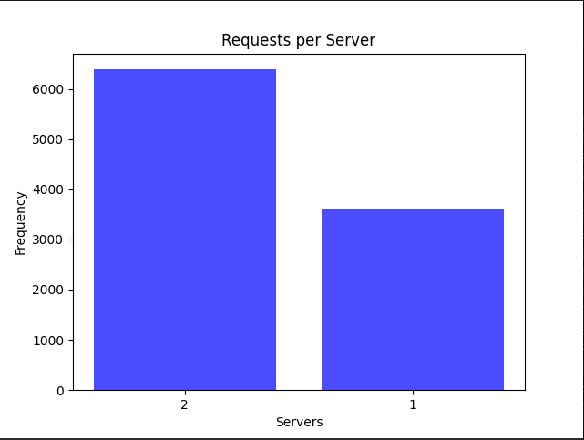
  - 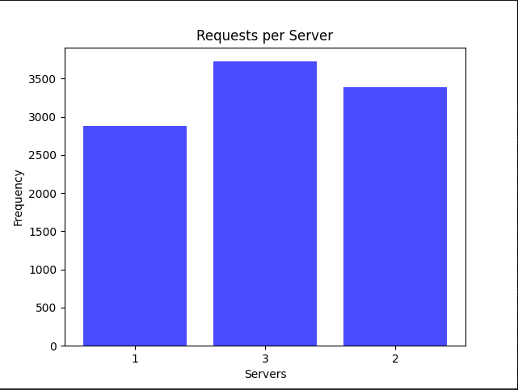
  - 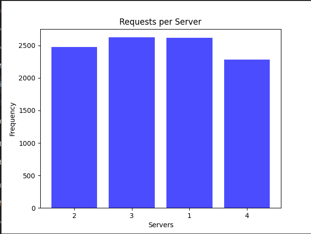
  - 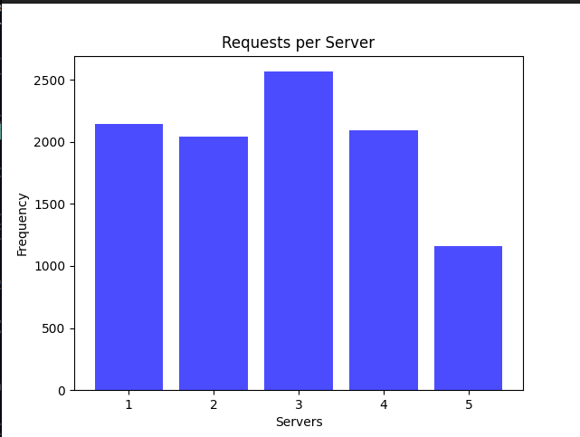
  - 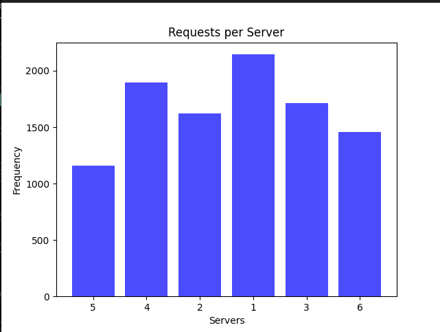
  - 


